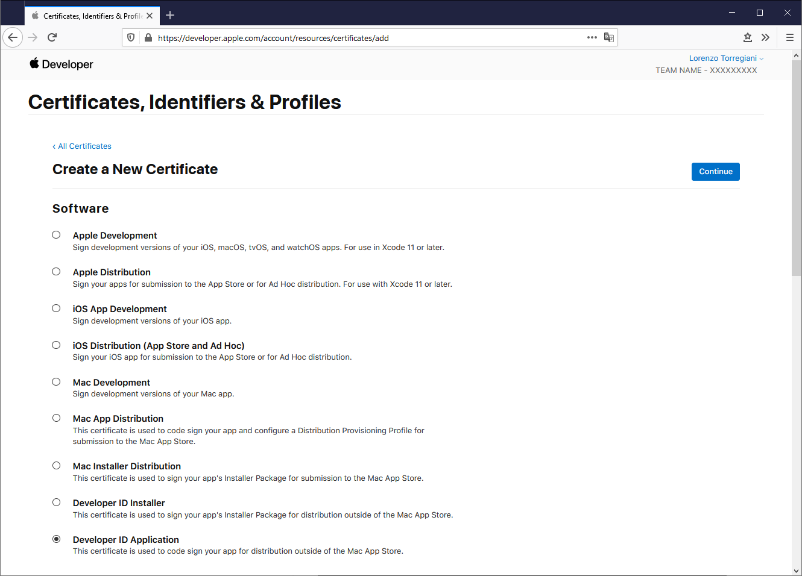

# Apple notarization guide

When a user runs an app for the first time, [macOS Gatekeeper](https://support.apple.com/en-us/HT202491) checks if it is notarized, so if it comes from a trusted developer.

To allow the process offline too, it is recommended to *staple* the notarization response to the file (see relative paragraph).

The notarization can be requested for app, plugin or bundle, dmg and pkg.  
If you want distribute via **pkg** or **dmg** (which can includes pkg), you can just notarize the pkg or the dmg, and everything inside will be notarized.  
In this case make that all element inside have a with valid sign.

## Sources

- https://developer.apple.com/documentation/xcode/notarizing_macos_software_before_distribution
- https://www.davidebarranca.com/2019/04/notarizing-installers-for-macos-catalina/
- https://www.kvraudio.com/forum/viewtopic.php?t=531663

## Prerequisites

- XCode 10 o higher (better if the latest version, downloadable from the App Store)
- Internet access
- Apple Developer ID (99€/year)
- [Specific password](https://support.apple.com/it-it/HT204397)

## Obtain a certificate

For your [Apple Developer Portal](https://developer.apple.com/) create, download and install a certificate. There are several kind of certificates, choose between:
- Developer ID Installer
- Developer ID Application 

You can verify that the certificate has been successfully installed with the command:

    security find-identity -v
    
    1) 7A7C3D1A28FA54F3E5E8857F2A12EDC71731CAED "Developer ID Application: Davide Barranca (I2WD7PWGD9)"
    1 valid identities found

## Signing

For the notarization to be successful, all elements must have a valid developer signature.

### Signing an app through XCode

1. Open XCode preferences and add your developer account;
2. In your project setting select your developer account and the right certificate;
3. Build your app.

### Signing an app without XCode

Use `codesign` for app, bundle, plugin or `productsign` for pkg.

    codesign -s "Developer ID Application: FATAR SRL (9L4T4JL6GX)" "/path_to_app.app" --timestamp  
    productsign --sign "eveloper ID Installer: FATAR SRL (9L4T4JL6GX)" ./installer.pkg ./installer_signed.pkg

### Verify the signature

Use `codesign` for app, bundle, plugin or `pkgutil` for pkg.  
Make sure that command response includes the Developer ID, otherwise the notarization will fail.

    codesign — verify — verbose /Applications/AppName.app  
    pkgutil --check-signature ./installer_signed.pkg

## Send the notarization request

### Via XCode

After *archiving* the build, press **Validate** and follow the procedure according to the chosen distribution method.

### Manually

    xcrun altool --notarize-app --primary-bundle-id "com.yourcompany.app" -u "myemail@mycompany.com" -p "specific_passowrd" -f "/full/path/to/the/installer_signed.pkg"

If there are no upload error, the command returns a request ID like `85b5e831-3fa0-4082-8ec8-d564d69869ef`.  
You can check a specific request status or see the history of all requests:

    xcrun altool --notarization-info 85b5e831-3fa0-4082-8ec8-d564d69869ef -u "myemail@mycompany.com" -p "specific_passowrd"  
    xcrun altool --notarization-history 0 -u "myemail@mycompany.com" -p "specific_passowrd"

### Appicciare l'esito della notarizzazione al file

This step is optional but recommended because it allows offline verification by Gatekeeper.

    $ xcrun stapler staple "/full/path/to/myapp.app"
    Processing: /full/path/to/myapp.app
    The staple and validate action worked!

## Check notorization in file

There are several ways to check if a file is notarized. Here are my favorites:

### spctl

    spctl -a -vvv -t exec /Path/To/Notarised.app  
    /Path/To/Notarised.app: accepted  
    source=Notarized Developer ID  
    origin=Developer ID Application: ***

Replace `exec` with `install` for **pkg**.

(`spctl` also allows to add, remove and list the allowed developer in the system)

### stapler

    stapler validate myfile.pkg  
    Processing: myfile.pkg  
    The validate action worked!

### Extra 1: Packages

[WhiteBox Packages](http://s.sudre.free.fr/Software/Packages/about.htmls) is a GUI tool for making pkg.  
You can sign a pkg with Packages to avoid use `productsign`.

### Extra 2: DMG Canvas

[Araelium DMG Canvas](https://www.araelium.com/dmgcanvas) is GUI tool for making dmg.  
From the version 3.x it is possible to automate the notarization process while building the dmg, including the stapling too.

